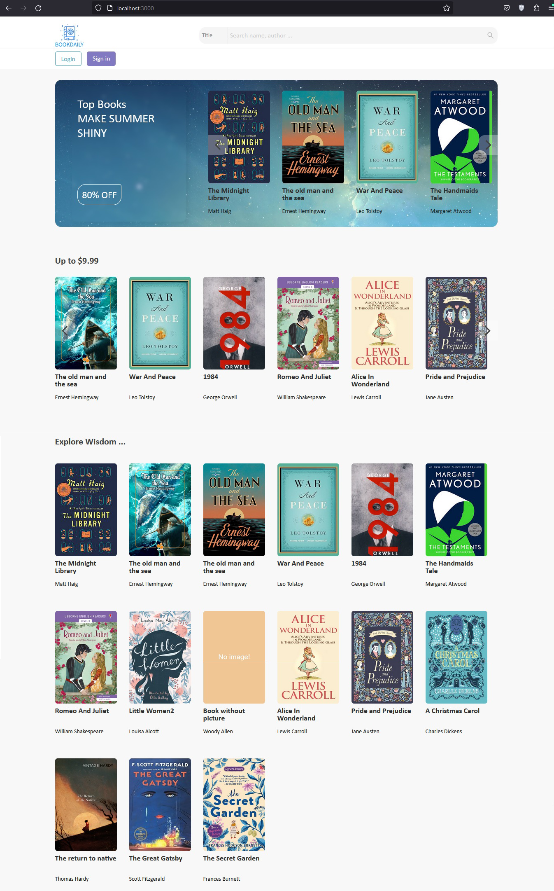
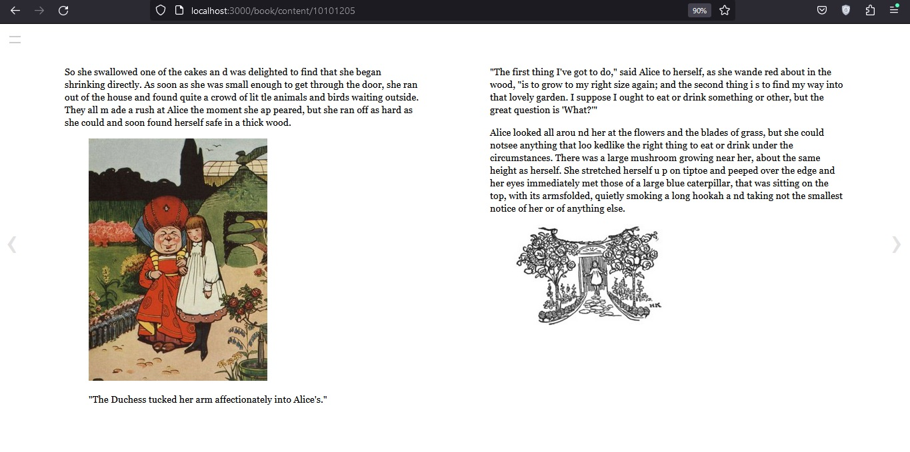
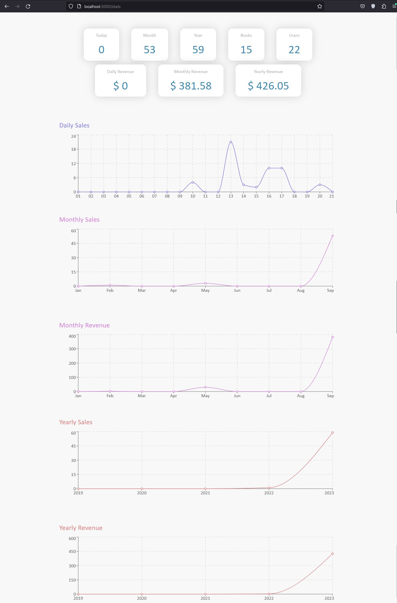

# Ebook Shop Website

A portfolio E-Book Shop Website made by **Node.js** and **React** for selling ebooks with **ePub** format. 
The books are mostly assumed to be from the treasury of classic literature.

 

## Home

 
 

## Book Details

 

## Book Content

 

## Statistics

 

## Some Features

### User
* Sign in
* Login
* Logout
* Search books based on different parameters
* Purchase (Demo)
* Read Book

### Admin
* Add book
* Edit
* Delete
* See statistics of sales and revenue

 

## Stack
* MySQL
* Express
* React
* Node.js
